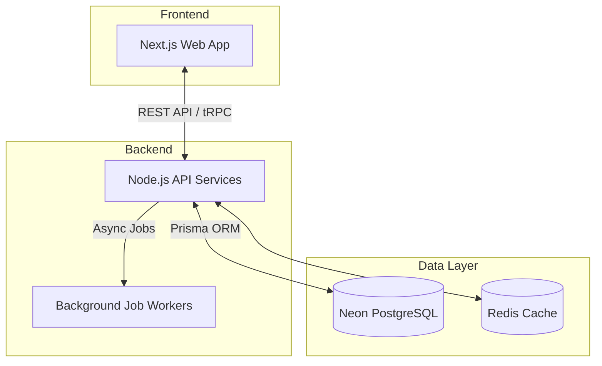
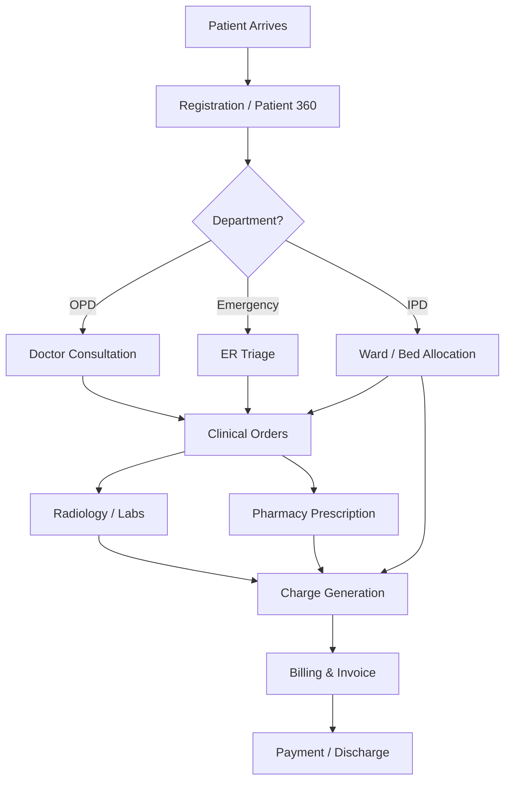

# Enterprise HMS - Comprehensive Testing & Feature Guide

Welcome to the **Enterprise Hospital Management System (HMS)**! This guide explains the architecture, patient flow, and exact pages available in this massive platform.

---

## 1. System Architecture

The HMS is built using a modern decoupled Monorepo architecture designed to scale to multi-tenant Enterprise hospital groups.

### The "Single Truth" Philosophy
* **One Patient:** Tracked as a single `Patient` record across all departments.
* **Tenant Isolation:** Every single record has a `tenantId` and `hospitalId`. A doctor in Branch A absolutely cannot see the financial records of Branch B.

---

## 2. Core Patient Flow

The database is fundamentally structured around the **Encounter** model. Every time a patient arrives, an Encounter is created, binding all subsequent actions (labs, pharmacy, billing) together.

---

## 3. Complete List of Pages (Website Map)

To test the application, ensure your server is running (`npx turbo dev`) and open `http://localhost:3000`. You can navigate to any of these routes:

### 🏠 Core / Dashboard
* `/dashboard` - Central Hub & Analytics
* `/patients` - Patient Directory
* `/patients/[id]` - Patient 360 View (Clinical history, past visits)
* `/appointments` - Scheduling & Doctor Slots
* `/queue` - Live Patient Queue Management

### 🛏️ Inpatient (IPD)
* `/ipd` - Inpatient overview
* `/ipd/admissions` - Active hospital admissions
* `/ipd/bed-board` - Visual map of available/occupied beds
* `/ipd/chart/[id]` - Inpatient clinical chart
* `/ipd/nursing` - Nursing flowsheets and vitals tracking
* `/ipd/rounds` - Doctor rounds and care plans

### 🧪 Diagnostics
* `/laboratory` - Lab Dashboard
* `/laboratory/worklist` - Active lab sample processing
* `/radiology` - Radiology Dashboard
* `/radiology/worklist` - Imaging worklist (X-Ray, MRI, CT)

### 💊 Pharmacy & Inventory
* `/pharmacy` - Pharmacy Point of Sale (POS)
* `/pharmacy/prescriptions` - Active electronic prescriptions
* `/inventory` - Core Inventory, Batches, and Stock Ledgers

### 💰 Revenue & Finance
* `/billing` - Revenue Cycle Dashboard
* `/billing/invoices` - Final patient bills
* `/billing/payments` - Payment receipts and ledgers
* `/billing/insurance` - TPA and Insurance Claims
* `/finance/ledger` - Enterprise General Ledger (Phase 8)

### 🏥 Hospital Operations
* `/operations/emergency` - ER Tracking
* `/operations/ot` - Operating Theater Scheduling
* `/operations/icu` - Intensive Care tracking
* `/operations/blood-bank` - Blood inventory
* `/operations/cssd` - Sterile supply tracking
* `/operations/dietary` - Inpatient meal plans
* `/operations/housekeeping` - Cleaning and ward prep
* `/operations/ambulance` - Fleet dispatch
* `/operations/procurement` - Purchase Orders & RFQs

### 👔 Enterprise Administration
* `/enterprise/admin` - Multi-hospital network config (Phase 8)
* `/hr/employees` - Employee Master and Payroll (Phase 8)
* `/hospitals` - Hospital branch management
* `/users` - System User & RBAC Permission management
